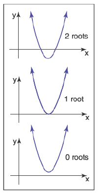
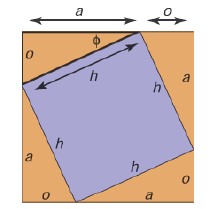
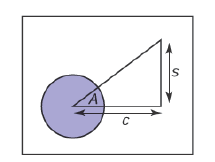

很多图形处理操作，是把数学公式翻译成代码的工作，公式越清晰，代码越简洁。本章主要是回溯高中和大学的一些数学工具。

## 2.1 集和映射 Sets and Mappings

映射（Mappings） 也叫函数（functions）,是基础的数学和编程概念。迹象程序中的函数一样，数学中的一个`mapping`通过一个类型的参数映射（return）一个特定类型的对象。在编程领域我们叫类型（type），数学中我们叫`set`。当某个对象属于一个set，使用`∈`符号表示。 例如：
$$a \in S$$

两个任意的set A和B，可以通过笛卡尔乘（Cartesian product）得到第三个集合 `A X B`。这个集合包含所有有序的pair（a,b）。
> set A，set B可以理解成表格的行和列。

为了方便，我们用`A²`来表示`A X B`。同样的，我们可以用笛卡尔乘的概念来表示多个集合的元素pair。

常见的集合包括：
- $R$：实数；
- $R^+$：包括0的正实数；
- $R^2$：实数2D平面pair集合；
- $R^n$：n维笛卡尔空间点；
- $Z$：整数；
- $S^2$：单位球面上的3D点的集合；

需要注意虽然$S^2$内嵌了3D集合（$R^3$），但仍然是通过两个变量表示的2D 集合。

映射符号使用箭头和冒号，例如：

$$ f:R\rightarrow Z $$

表示有一个函数f,其输入集合是实数，映射结果是整数。箭头之前的集合叫`域（domain）`，箭头后的叫`目标（target）`

$f(a)$叫做`a`的`图像（image）`。集合`A`（域的子集）的图像，是`A`中元素的图像的目标的子集。整个域的图像叫做函数的`范围（range）`。

> 有点绕，我理解就是：函数的image是指这个函数可能产生的的所有值的集合。

## 2.1.1 逆映射 Inverse Mapping
函数$ f:A\rightarrow B $可能存在一个逆函数$ f^{-1}:B\rightarrow A $。即$f^{-1}(b)=a，f(a)=b$。这种情况会在ab是一对一关系时出现，这样的函数叫做`双射(bijection)`

## 2.1.2 区间 Intervals
- 开放区间 open interval

    例`(0,1)` : 表示0-1之间的数，不包含0和1
- 闭合区间 close interval
    
    例`[0,1]` : 表示0-1之间的数，包含0和1

笛卡尔乘在区间中经常会被试用，例如，点`x`在单位矩体中可表示为：$x\in[0,1]^3$

区间在结合集合操作时，常常非常有效。交集(intersection $\cap$)、并集(union $\cup$)和差集(difference $-$)。

examples：

$$ [3,5) \cap [4,6]=[4,5) $$
$$ [3,5) \cup [4,6]=[3,6] $$
$$ [3,5) - [4,6]=[3,4) $$

## 2.1.3 对数 Logarithms

每个对数都有`基（base）`a，x的基为a的对数写做$ \log _a x$。

$$ y=\log _a x  \Leftrightarrow a^y=x$$

常用的等式：

$$ a^{\log _a (x)}=x;$$
$$ \log _a (a^x)=x;$$
$$ \log _a (xy)=\log _a x+\log _a y;$$
$$ \log _a (x/y)=\log _a x-\log _a y;$$
$$ \log _a x=\log _a b \log _b x;$$

当我们计算对数时，会看到一个特殊的数`e=2.718...`。基为`e`的对数被称为自然对数（natural logarithm），用以下缩写表示：

$$  \ln x \equiv \log _e x.$$

$\equiv $表示定义上相等。

为什么自然对数是`自然的`：

$$ \frac{d}{dx} \log _a x= \frac{1}{x\ln a} ;$$
$$ \frac{d}{dx} a^x= a^x\ln a ;$$

## 2.2 求解二次函数 Solving Quadratic Equations

二次函数的形式：
$$Ax^2+Bx+C=0,$$

由于二次函数是抛物线，所以x的值有下图中三种情况：

令$D=B^2-4AC$，我们可以通过D来判断上图的三种情况。$D>0$，x有两个实数解;$D=0$，x有一个实数解;$D<0$，x没有实数解。

## 2.3 三角学 Trigonometry

### 2.3.1 角 Angles

在单位圆中，被两个从圆心射出的向量（按一定顺序），切割出的长度叫做角。单位圆的周长为$2\pi$,所以被切割的弧长范围为$[-\pi,\pi]$，其单位为弧度（radians）。另一种表示单位是角度（Degrees），把单位圆周长表示为360°，那对应的$\pi$就是180°。

弧度和角度的转换公式如下：
$$Degrees=\frac{180}{\pi}radians;$$
$$Radians=\frac{\pi}{180}degrees.$$

### 2.3.2 三角函数 Trigonometric Functions

基于下图，我们可以得到$(a+o)^2=h^2+2ao$，从而得到三角形的斜边定理：
$$ a^2+o^2=h^2$$

 我们定义$\phi$ 的正弦（sine）和余弦（cosine），以及其他基于比率的表达式:

$$\sin \phi \equiv o/h;$$
$$\csc \phi \equiv h/o;$$
$$\cos \phi \equiv a/h;$$
$$\sec \phi \equiv h/a;$$
$$\tan \phi \equiv o/a;$$
$$\cot \phi \equiv a/o;$$

这些定义让我们可以设置一个极坐标（polar coordinates），用距离和角度表示一个点，角度$\phi \in (-\pi,\pi]$

三角函数是周期性的，可以用任意角度作为参数,例如$\sin(A)=\sin(A+2\pi)$,这也意味着函数域为R时，是不可逆的。为了避免这样的情况，现代数学库定义了域和范围:

$$asin:[-1,1] \rightarrow [-\pi/2,\pi/2]; $$
$$acos:[-1,1] \rightarrow [0,\pi]; $$
$$atan:R \rightarrow [-\pi/2,\pi/2]; $$
$$atan2:R^2 \rightarrow [-\pi,\pi]; $$

最后的$atan2(s,c)$非常有用。它的`s`参数与`sin A`成比例关系，参数`c`和`cos A`有同样的比例。返回`A`，也可以看作是，返回2D点（s,c）在极坐标中的角度。

### 2.3.3 常用的特性 Useful Identities

- 交换特性 Shifting identities

$$ \sin(-A)=-\sin A $$
$$ \cos(-A)=\cos A $$
$$ \tan(-A)=-\tan A $$
$$ \sin(-A)=-\sin A $$
$$ \cos(-A)=\cos A $$
$$ \tan(-A)=-\tan A $$

- Pythagorean特性 Pythagorean identities

> 勾股定理（Pythagorean theorem）的拓展

$$ \sin^2 A+ \cos^2 A=1 $$
$$ \sec^2 A- \tan^2 A=1 $$
$$ \csc^2 A- \cot^2 A=1 $$

- 加减特性 Addition and subtraction identities

$$ \sin(A+B)=\sin A \cos B+\sin B \cos A $$
$$ \sin(A-B)=\sin A \cos B-\sin B \cos A $$
$$ \sin(2A)=2\sin A \cos A $$
$$ \cos(A+B)=\cos A \cos B-\sin A \sin B $$
$$ \cos(A-B)=\cos A \cos B+\sin A \sin B $$
$$ \cos(2A)=\cos^2 A- \sin^2 A $$
$$ \tan(A+B)=\frac{\tan A +\tan B}{1-\tan A\tan B}$$
$$ \tan(A-B)=\frac{\tan A -\tan B}{1+\tan A\tan B}$$
$$ \tan(2A)=\frac{2\tan A}{1-\tan^2 A}$$

- 半角特性 Half-angle identities

$$ \sin^2 (A/2)=(1- \cos A)/2 $$
$$ \cos^2 (A/2)=(1+ \cos A)/2 $$

- 乘积特性 Product identities
$$ \sin A \sin B=-(\cos(A+B)-\cos(A-B))/2 $$
$$ \sin A \cos B=(\sin(A+B)-\cos(A-B))/2 $$
$$ \cos A \cos B=(\cos(A+B)+\cos(A-B))/2 $$

以下公式适用于任意三角形，其边为a、b、c，对应的角度为A、B、C：

$$ \frac{\sin A}{a}=\frac{\sin B}{b}=\frac{\sin C}{c}   \  (Law\ of\ sines)$$

$$ c^2==a^2+b^2-2ab\cos C  \ (Law\ of\ cosines)$$

$$ \frac{a+b}{a-b}=\frac{\tan (\frac{A+B}{2})}{\tan (\frac{A-B}{2})} \ (Law\ of\ tangents)$$

三角形的面积同样可以通过边长计算得出：

$$ \text{Triangle area}=\frac{1}{4}\sqrt{(a+b+c)(-a+b+c)(a-b+c)(a+b-c)}$$

### 2.3.4 立体角和球面三角 Solid Angles and Spherical Trigonometry

传统三角学处理平面上的三角形，但三角形也可以被定义在非平面的表面。例如把三角形定义在单位球上，三角形的边是球面上的弧线，这种叫做球面三角。球面三角在图形应用中不多见，但也很重要。

图形学中另外一种重要的三角叫做立体角。角度让我们可以衡量视野中极点的距离，立体角则告诉我们物体在我们视野中的量。角度是单位圆内的弧长，单位是弧度（radians），最大值为$2\pi$（单位圆周长）；立体角是单位球内的区域面积，单位是球面度（steradian）最大值为$4\pi$（单位球面积）。

## 2.4 向量 Vectors

### 2.4.1 向量运算 Vector Operations

### 2.4.2 向量的笛卡尔坐标 Cartesian Coordinates of Vector
### 2.4.3 点乘 Dot Product
### 2.4.4 叉乘 Cross Product
### 2.4.5 正交基和坐标系 Orthonormal Base and Coordinate Frames
### 2.4.6 从一个向量构造基 Constructing a Basis from a Single Vector
### 2.4.7 从两个向量构造基 Constructing a Basis from Two Vectors
### 2.4.8 处理一个基 Squaring Up a Basis

## 2.5 积分 Integration

### 2.5.1 Averages and weighted averages
### 2.5.2 Integrals over solid angle

## 2.6 密度函数 Density Functions

